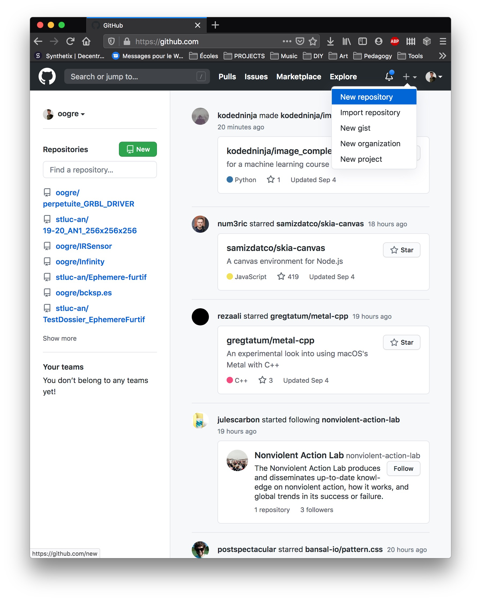

# Hello World

«Hello World» est un projet traditionnel de la culture de la programation informatique. Il s'agit d'un simple exercice qui te permet de démarrer l'apprentissage de quelque chose de neuf.
C'est partit pour démarrer avec GitHub!

### Tu apprendras à :

- créer et utiliser un *repository*

- créer et modeler de nouvelles *branch*

- éditer des fichiers et les *push* sur GitHub en tant que *commit*

- ouvrir et à *merge* une *pull request* 

---

## Qu'est-ce que GitHub

GitHub est une plateforme d'hébergement de code permettant le versionnage et la collaboration. Il te permet de découvrir, d'utiliser et de participer au développement de centaines de milliers de projets OpenSource.

Ce tutoriel t'enseigne les bases essentielles de GitHub comme les *repositories*, les *branches*, les *commits* et les *pull requests*. Tu va créer ton propre *repository* «Hello World» et découvrir le workflow des Pull Request à la GitHub qui est une manière populaire de créer et de modifier du code.

**Aucun niveau particulier en programmation n'est requis**

Pour suivre ce tutoriel, tu as besoin d'un compte sur https://github.com et d'un accès à Internet. Tu n'auras besoin ni de connaissance en programmation, ni en ligne de commande ni en GIT (l'outil de contrôle de version [créé par [Linus Torvalds](https://fr.wikipedia.org/wiki/Linus_Torvalds "Linus Torvalds"), auteur du [noyau Linux](https://fr.wikipedia.org/wiki/Noyau_Linux) sur le quel GitHub est construit)

> **Astuce :** Ouvre ce guide dans une fenetre de navigation en parallèle, de la sorte tu pourras suivre ses instruction pour compléter les étapes de ce tutoriel.

## Étape 1 Créer un *Repository*

Un *repository* est habituellement utiliser pour organiser un unique projet. Il peut contenir des dossiers et des fichier, images, vidéos, bases de données, code source et documentation - bref tout ce dont un projet nécéssite. Nous recommendons d'y inclure un fichier README.md contenant les information sur le projet et stocké dans le dossier racine. GitHub fait en sorte qu'il soit facile de créer ce fichier au moment où vous créer un nouvea *repository*. Il permet aussi entre autre de créer le fichier de licence.

Ton *repository* `hello-world` peut être placé où vous disposer vos idées, resources ou bien sûr dans un dossier de travail relatif à l'année en cours et au cadre de travail. **Exemple : **`/Users/Vincent/2020/esa-bxl/atelier/progra/hello-world`

**Pour créer un nouveau *repository***

Sur https://github.com :

1. Dans le coin superieur droit, à côté de votre avatar, click sur **+** et sélectionne **New Repository** 
   
   

2. Baptises ton repository `hello-world`

3. Écris une courte description

4. Sélectionne **Initialize this repository with a README**

5. Sélectionne **Add .gitignore**

6. Click **Create repository**
   
   
   
