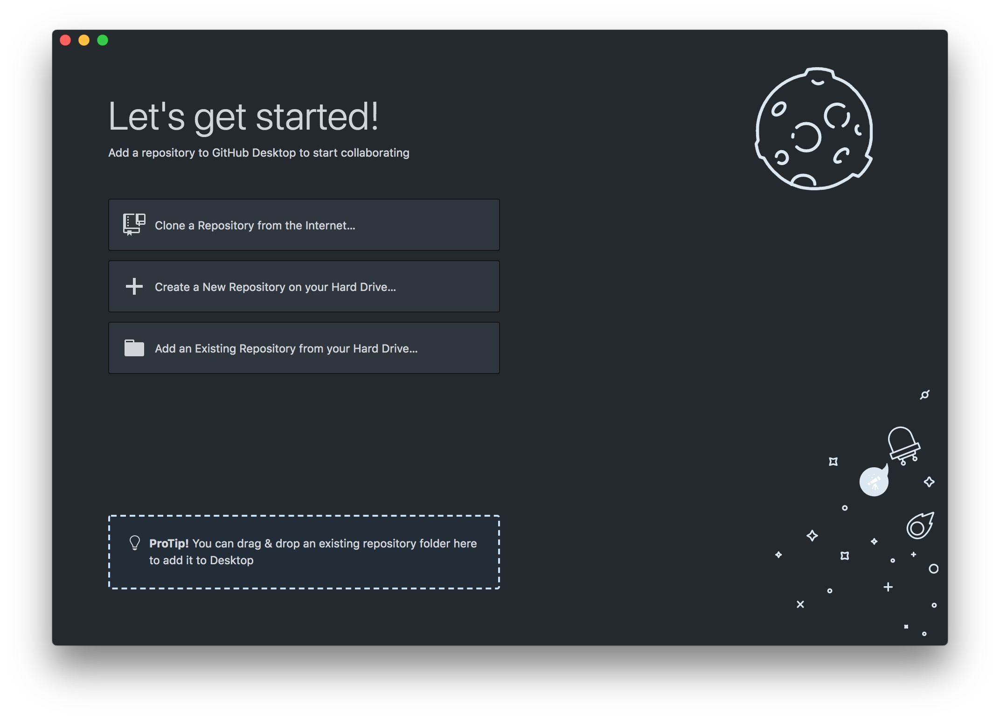
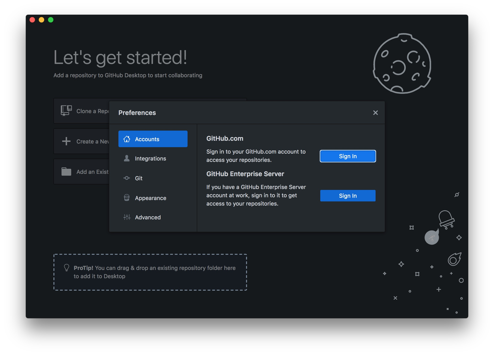
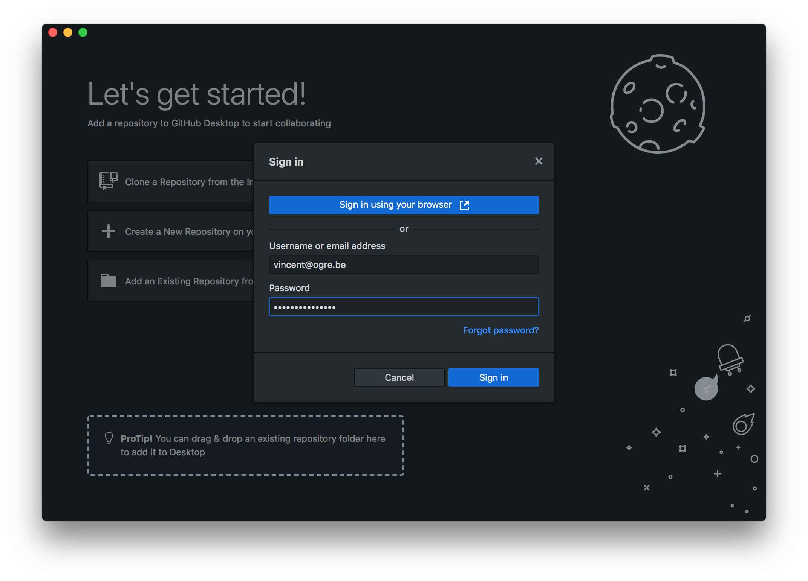
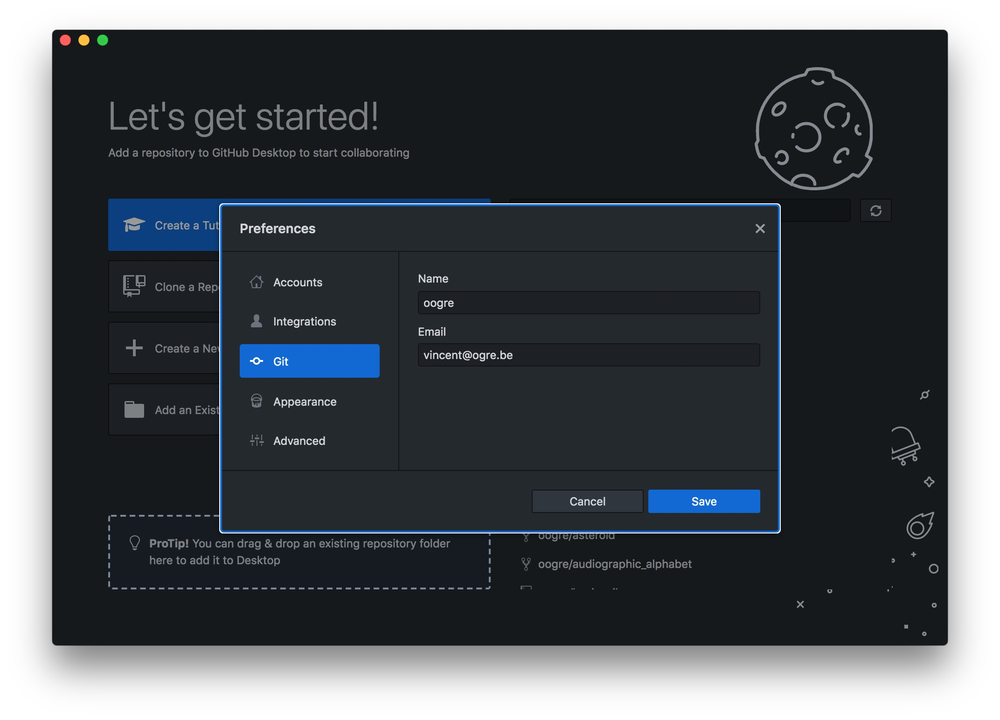
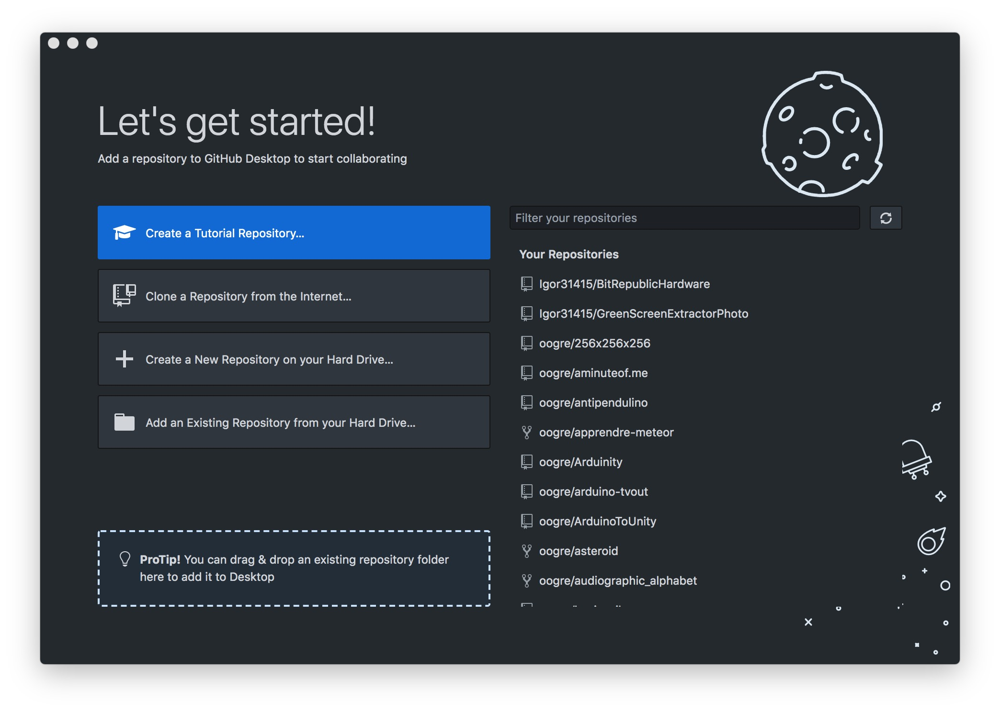
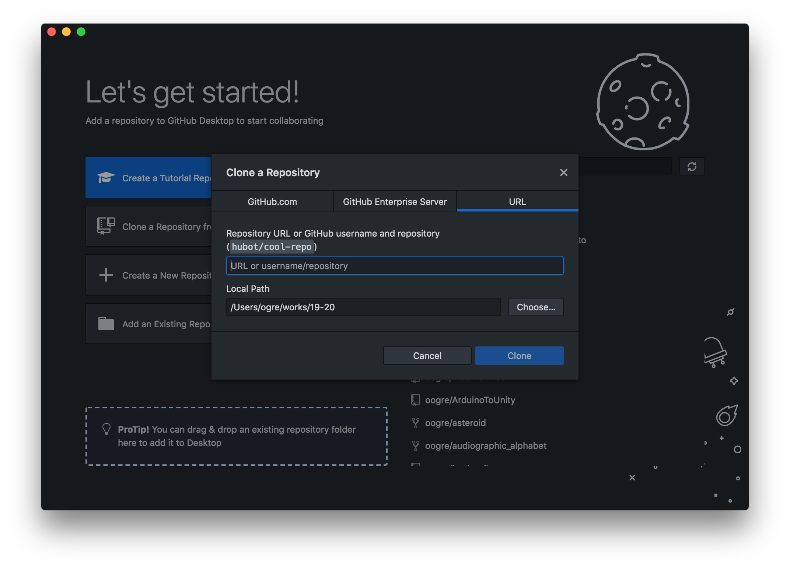
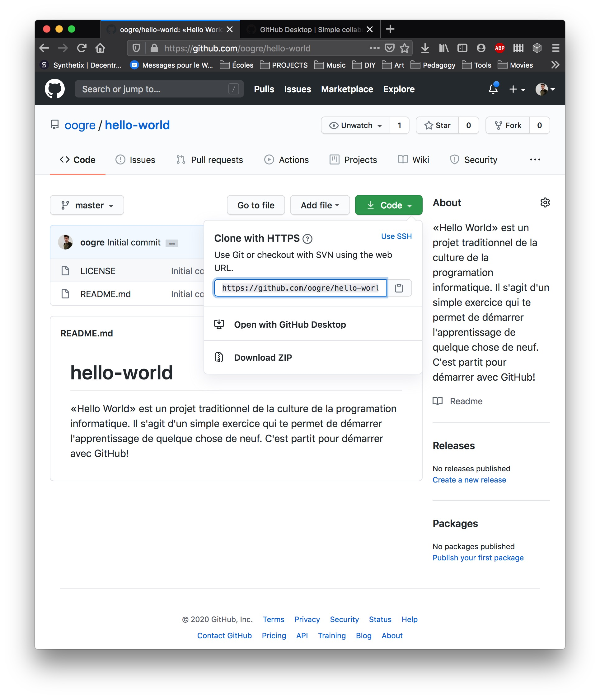
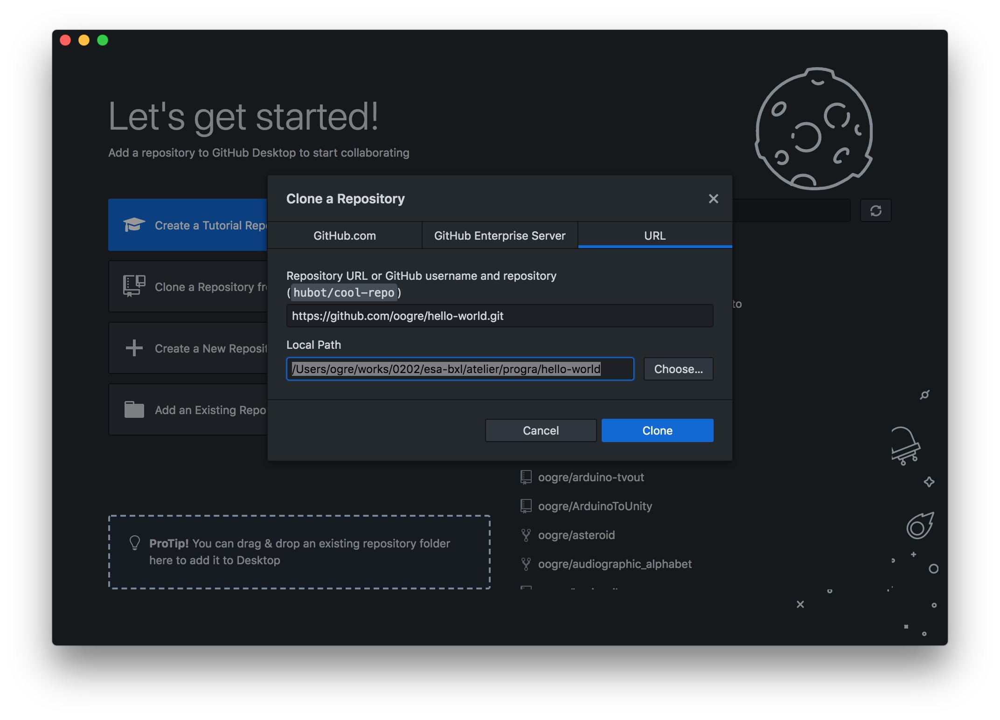

## Étape 2 Cloner un *repository* sur votre ordinateur

À l'heure actuelle ton *repository* n'existe que sur [The world’s leading software development platform · GitHub](https://github.com) il n'est pas présent sur le disque dur de ton ordinateur. Afin de pouvoir travailler sur ces fichier, tu vas devoir créer un clone ce projet en local (sur ta machine).

#### Github Desktop

Rends-toi sur le site [GitHub Desktop | Simple collaboration from your desktop](https://desktop.github.com) pour télécharger Github Desktop. Installe ce logiciel sur ton ordinateur.

Affiche le menu préférence

Dans la section Accounts/Sign In avec tes identifiants GitHub

Dans la section Git inscrit ton nom et ton email

Click sur **Clone a Repository from Internet...**

Dans l'input text nommée URL copie colle le lien que tu trouvera sur le site de Github derrière le bouton Code (Vert)

Ton *repository* `hello-world` peut être placé sur ton disque dur où tu disposes tes idées, resources ou bien sûr dans un dossier de travail relatif à l'année en cours et au cadre de travail. **Exemple : **`/Users/Vincent/2020/esa-bxl/atelier/progra/hello-world`

Lorsque tout est configuré click sur Clone

## [Étape 3 : éditer des fichiers et les *push* sur GitHub en tant que *commit](./cloneRepository.md)
