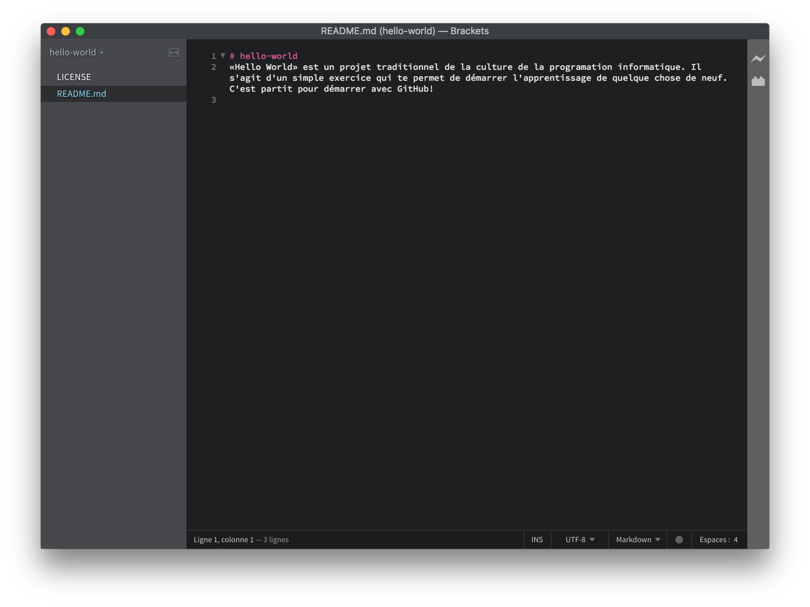
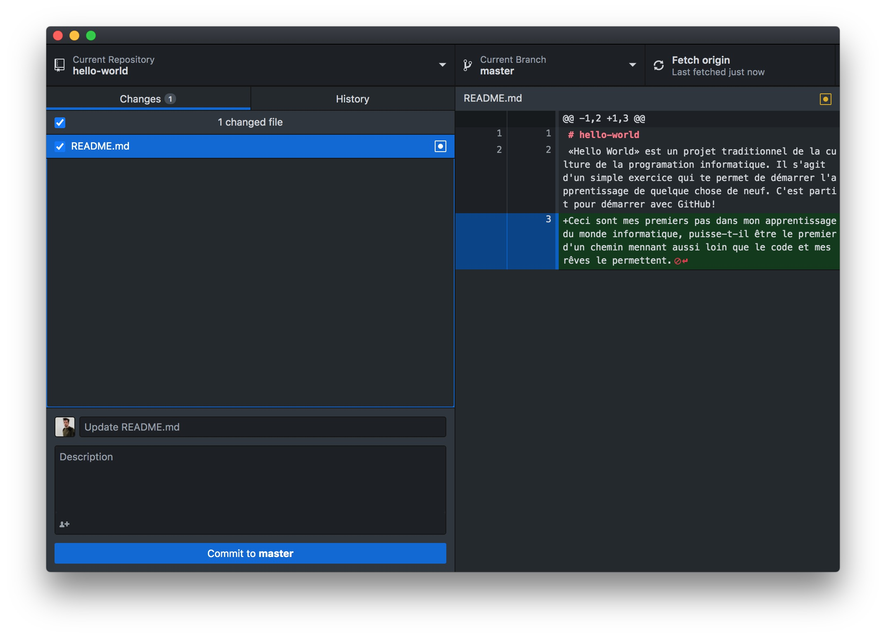

## **Étape 3** éditer des fichiers et les *push* sur GitHub en tant que *commit*

Il est emps d'ouvrir et d'éditer les fichiers de votre projet `hello-world`. Au moyen de ton explorateur de fichier, rends-toi dans le dossier où tu les as cloné. Ces fichiers ont donc bien une présence physique sur ton disque dur et maintenant tu en as la certitude.

Dans le cadre de ce cours nous aurons besoin d'un type de logiciel particulier, appelé **Éditeur de Code**. Il en existe toute une tripotée (Visual Studio, Notepad++, xCode, ...) Nous allons préférer l'utilisation de Brackets car il s'agit d'une solution moderne, efficace et Open Source bénéficiant d'une communauté active et compétante.

Je t'invite à te rendre sur http://brackets.io afin de télécharger et d'installer ce programme. Lorsque celui-ci est installer et ouvert. Rends-toi dans le menu `File/Open Folder` et selectionne grace à l'explorateur de fichier ton dossier **hello-world** que tu viens de retrouver au paragraphe précédent.

Tu peux remarquer que la colone de gauche indique la présence de deux fichiers dans le dossier hello-world. 

- LICENSE
  
  - Lorsque tu selectionne celui-ci, tu vois dans la partie de droite le texte juridique qui définit la License d'exploitation de ce projet.

- README.md
  
  - Lorsque tu selectionne celui-ci, tu vois dans la partie de droite le titre du projet et la description que tu avais fournis à GitHub lors de la creation du *repository*.

Commençons par éditer le contenu du fichier README.md, pointes ton curseur d'écriture après le dernier caractère de la dernière ligne et écris. `Ceci sont mes premiers pas dans mon apprentissage du monde informatique, puisse-t-il être le premier d'un chemin mennant aussi loin que le code et mes rêves le permettent.`

Remarque que le nom du fichier en cours d'édition apparaît maintenant dans le haut de la colonne de gauche. Il y a même une puce ronde devant le titre pour t'indiquer que le fichier à été modifier mais pas encore sauvegarder.  Qu'attends-tu donc pour presser les touche `CTRL+S`ou `CMD+S` pour inscrire ces modification sur ton disque dur? Vois-tu que la puce ronde a disparu?

Félicitation tu viens d'éditer ton premier fichier faisant partie d'un projet de programmation. Je te souhaite d'en modifier et d'en créer beaucoup et des biens. Il s'agit maintenant d'envoyer ces modification en ligne sur le site de GitHub afin d'Archiver et de Partager cette prose pleine d'émotions au monde entier.

**Mon premier Commit + Push**

Retourne sur l'interface de GitHub Desktop.

Tu peux voir dans la colonne de gauche la liste des fichier ayant subit une modification. Il n'y a que le fichier README.md dans mon cas. 

La checkbox ce situant à gauche du nom de fichier est cochée cela signifie que la mise à jour de ce fichier fera partie du packet de mise à jour que l'on va introduire dans le sytème GIT.

Le cadre inférieur à la colonne gauche t'invite à y écrire une description descriptive de cette mide à jour. Introduis-y `Ceci est ma toute première description. Elle n'est donc pas parfaitement descriptive, mais nous avons le temps pour atteindre la perfection`. Click ensuite le bouton **Commit to master** en bleu juste en dessous. 

Tu viens d'introduire ta mise à jour dans le système GIT présent sur ton ordinateur. L'information n'a pour autant pas encore été envoyée sur GitHub. Pour ce faire, regarde en haut à droite de la fenêtre de GiHub Desktop. Il y a un Bouton **Fetch origin** est devenu un bouton indiquant **Push origin** cela signifie que GitHub Desktop est prêt pour envoyer ta mise à jour en ligne.

## [**Étape 4** mise à jour de votre version locale le *pull* et résoudre un *Conflict*](./pull.md)
