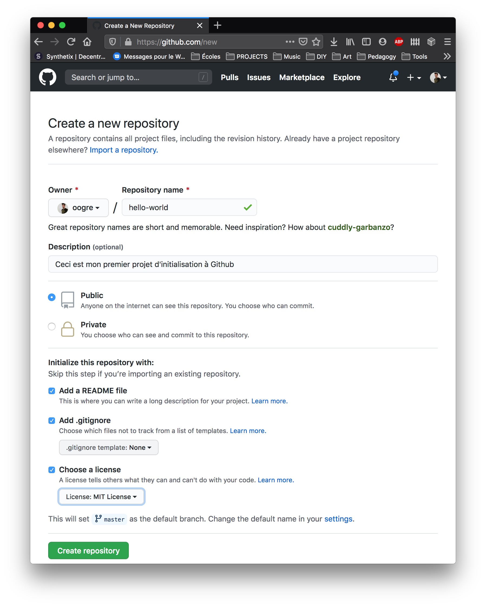

## **Étape 1** Créer un *Repository*

Un *repository* est habituellement utilisé pour organiser un unique projet. Il peut contenir des dossiers et des fichiers, images, vidéos, bases de données, code source et documentation... tout ce dont un projet nécéssite. 

Nous recommendons d'y inclure un fichier README.md contenant la documentation du projet et stocké dans le dossier racine. GitHub fait en sorte qu'il soit facile de créer ce fichier au moment où tu crées un nouvea *repository*. Il permet aussi entre autre de créer le fichier de licence.

---

### Créer un nouveau *repository*

Sur [GitHub.com](https://github.com) :

1. Dans le coin superieur droit, à côté de votre avatar, click sur `+` et sélectionne `New Repository`
   
   

2. Baptise ton repository `hello-world`

3. Écris une courte description

4. Sélectionne `Add a README file`

5. Sélectionne `Add .gitignore`

6. Sélectionne `Choose a licence` *MIT License est une license Open Source corecte pour le genre de projets que nous développerons dans ce cadre.*

7. Click `Create repository`

### [**Étape 2** Cloner un *repository*](./cloneRepository.md)
