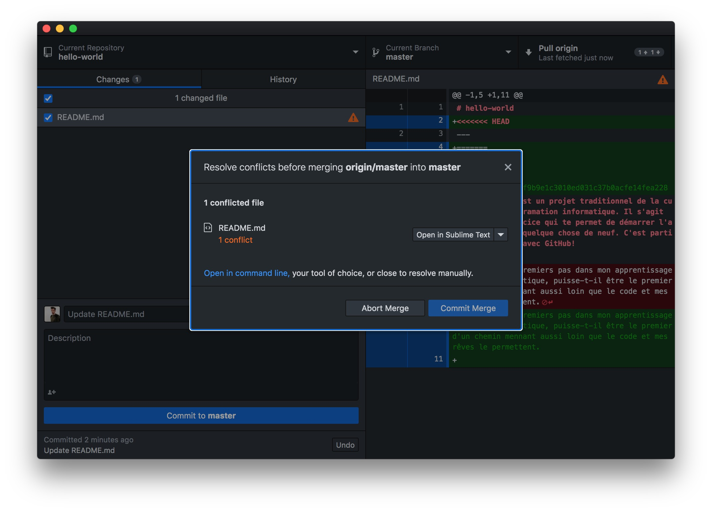
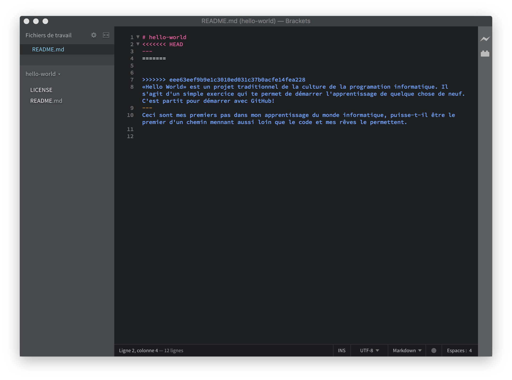
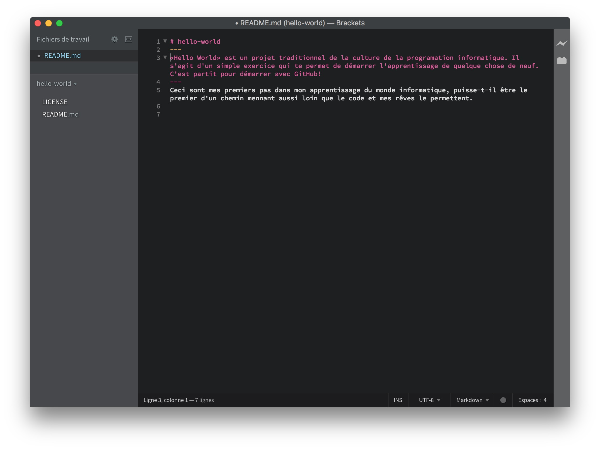

## **Étape 4** mise à jour de votre version locale le *pull*

Si tu travaille avec deux ordinateurs sur un même projet ou si tu collabore avec un ami. Il t'arriveras de devoir récupérer une mise à jour depuis GitHub vers ton ordinateur. 

Tu dois t'assurer que tous tes fichier suceptible d'être mise à jour soit au minimum Commit (la colonne de gauche de l'UI GitHub Desktop doit être vide). En suite tu click sur le bouton **Fetch origin** en haut à droite de l'interface si il est présent, ou directement sur le bouton **Pull origin** dans le même espace. 

Voila ta version local est à jour.

Il est possible qu'une mise à jour montante (celle de ton ordi vers GitHub) et qu'une mise à jour descentente (celle de GitHub vers ton ordi) ne soit pas compatible car des modifications ont été réalisées dans la même région d'un même fichier. Il s'agit d'un *Conflit*.



Dans ce cas ouvre avec Brackets le fichier incriminé.



Tu verras que Git as ajouter intégrer les deux mise à jour et qu'il te faut choisir. 

```<<<<<<< HEAD
<<<<<<< HEAD
MISE À JOUR MONTANTE
=======
MISE À JOUR DESCENDANTE
>>>>>>> eee63eef9b9e1c3010ed031c37b0acfe14fea228
```

Édite le fichier, pour résoudre ce *conflit*. Et Enregistre.



GitHub Desktop t'indiqueras lorsque le *Conflit* est résolut.


Tu n'aura alors qu'a clicker sur *Commit Merge* et sur Push Origin pour publier la résolution du conflit sur GitHub.


