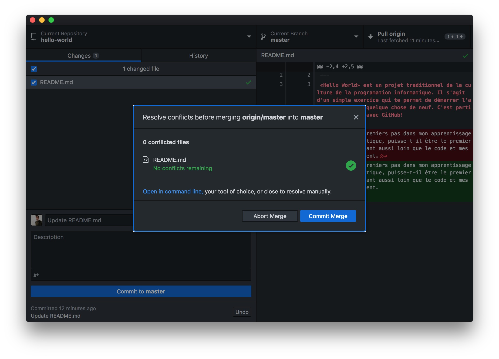

## **Étape 4** Mettre à jour ta version local, *pull* et résoudre un *Conflict*

> Si tu travaille avec deux ordinateurs sur un même projet ou si tu collabore avec un ami. Il t'arriveras de devoir récupérer une mise à jour depuis GitHub vers ton ordinateur. 

Tu dois t'assurer que tous tes fichiers suceptibles d'être mis à jour soit au minimum *Commit* (la colonne de gauche de l'UI GitHub Desktop doit être vide). En suite tu click sur le bouton `Fetch origin` en haut à droite de l'interface si il est présent, ou directement sur le bouton `Pull origin` dans le même espace. 

Voila ta version local est à jour.

---

### *Conflict* Warning

Si une mise à jour montante (celle de ta version local vers GitHub) et une mise à jour descentente (celle de GitHub vers ta version local) ne sont pas compatible, cela arrive lorsque des modifications ont été réalisées dans deux version différentes et dans les   même régions d'un même fichier. Il s'agit d'un *Conflit*.

> Si tu tombes sur un conflict pas de soucis.


Dans ce cas ouvre avec Brackets le fichier incriminé.


Tu verras que Git a intégrer les deux mise à jour et qu'il te faut choisir. 

```<<<<<<<
<<<<<<< HEAD
MISE À JOUR MONTANTE
=======
MISE À JOUR DESCENDANTE
>>>>>>> eee63eef9b9e1c3010ed031c37b0acfe14fea228
```

Édite le fichier, pour résoudre ce *conflit*. Et Enregistre.


GitHub Desktop t'indiqueras ceci lorsque le *Conflit* est résolut.



Tu n'aura alors qu'a clicker sur `Commit Merge` et sur `Push Origin` pour publier la résolution du conflit sur GitHub.

### [Créer et modeler de nouvelles *branch* sur un projet communautaire, *pull request*](./collaboration.md)
